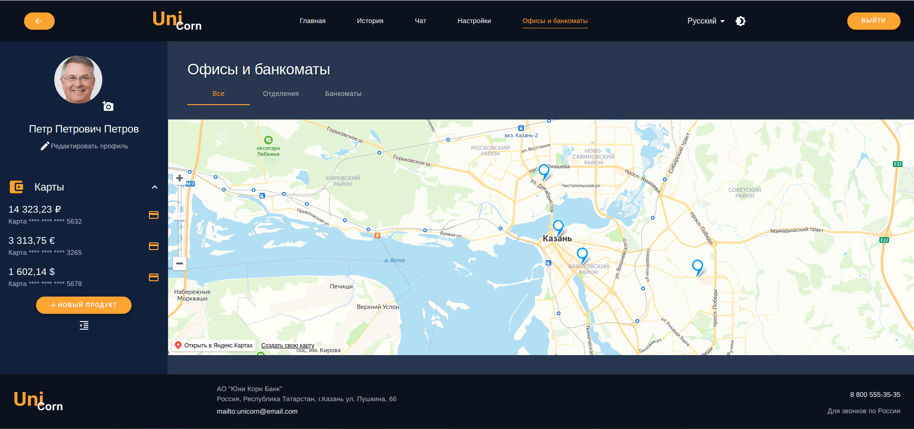
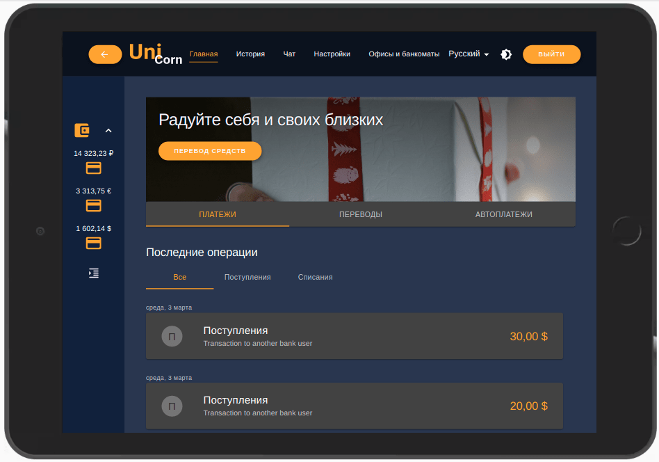
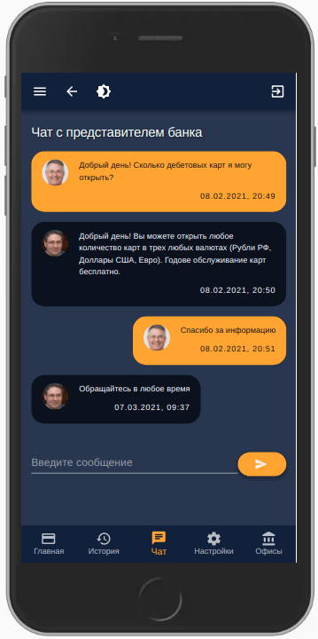

<h1 align="center">Проект "Банковское приложение"</h1>
<h2 align="center">Команда UniCorn</h1>

### В проекте реализовано банковское приложение [Uni Corn Bank](https://unicorn-bank.web.app/) для мобильных и десктопных устройств

## Десктоп



## Мобильные девайсы




## **Инструкция по развертыванию проекта**

1. Склонировать репозиторий в локальную директорию

```
$ git clone https://github.com/zlldnv/unicorn.git
```

2. Установить node modules

```
$ yarn
```

3. Запустить с помощью локального сервера

```
$ yarn start
```

## **О проекте**

### **Основные технологии и инструменты**

- [React](https://reactjs.org/)
- [TypeScript](https://www.typescriptlang.org/)
- [Material UI](https://material-ui.com/)
- [Firebase](https://firebase.google.com/)
- [Recoil](https://recoiljs.org/)

### **Глобальные опции приложения**

- Интернационализация на трех языках
  - Русский
  - Английский
  - Татарский
- Возможность изменения темы
  - темная
  - светлая

### **Функционал для пользователя**

#### _Страница авторизации/регистрации_

На странице авторизации пользователь может авторизоваться. В случае входа неавторизованного пользователя необходимо пройти сначала регистрацию на странице регистрации.

#### _Навигация_

- Навигация по страницам:
  - на десктопе в хэдере
  - на планшете в хэдере/нижнем баре
  - на телефоне в нижнем баре
- В левой боковой панели:
  - фото с данными пользователя
  - навигация по продуктам пользователя
  - кнопка открытия нового продукта

#### _Главная_

- блок с быстрыми услугами (перевод денежных средств)
- блок с последними пятью операциями пользователя по всем картам
- блок курсов ЦБ РФ основных валют

#### _Карты_

- блок данных карты (баланс, статус, срок действия)
- блок с доступными действиями по карте (Блокировка, первыпуск, просмотр реквизитов)
- блок последних операций по текущей карте

#### _Профиль_

- блок контактных данных пользователя
- блок документов пользователя

#### _Настройки_

- блок изменения пароля пользователя

#### _История_

- блок фильтрации карт
- блок последних операций по всем картам пользователя

#### _Оффисы и банкоматы_

- блок с картой расположения офисов и банкоматов банка

#### _Чат_

- блок с чатом с представителем банка

### **Функционал для представителя банка**

#### _Чат_

- боковая панель с чатами с клиентами банка
- блок с чатом с выбранным клиентом банка

### **Планы по расширению функционала**

- добавить продукт кредитная карта с калькулятором
- добавить продукт вклад с калькулятором
- поиск по приложению
