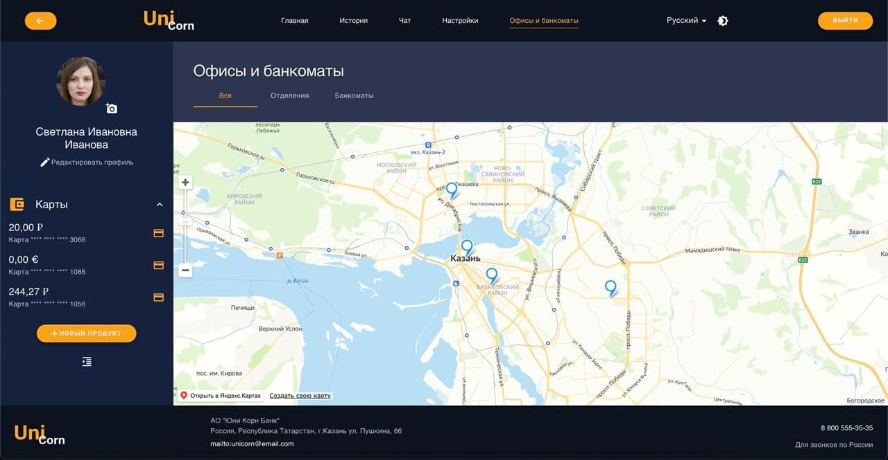

<h1 align="center">Project "Banking Application"</h1>
<h2 align="center">UniCorn Team</h1>

### Bank application [Uni Corn Bank](https://unicorn-bank.web.app/) for mobile and desktop devices implemented in the project

## Desktop



## Mobile devices


## **Project deployment instruction**

1. Clone repository to local directory

```
$ git clone https://github.com/zlldnv/unicorn.git
```

2. Install node modules

```
$ yarn
```

3. Run with local server

```
$ yarn start
```

## **About project**

### **Basic technologies and tools**

- [React](https://reactjs.org/)
- [TypeScript](https://www.typescriptlang.org/)
- [Material UI](https://material-ui.com/)
- [Firebase](https://firebase.google.com/)
- [Recoil](https://recoiljs.org/)

### **Global application options**

- Internationalization in three languages
  - Russian
  - English
  - Tatar
- Theme change option
  - dark
  - light

### **User functionality**

#### _Authorization/Registration page_

The user can login to the authorization page. If an unauthorized user logs in, you must first register on the registration page.

#### _Navigation_

- Navigation on the pages:
  - on desktop in header
  - on the tablet in header/lower bar
  - on the phone in the lower bar
- In the left side panel:
  - user photo
  - product navigation
  - new product open button

#### _Main_

- quick service block (money transfer)
- block with the last five user operations on all cards
- block of CBR rates of major currencies

#### _Cards_

- card data block (balance, status, validity)
- block with available actions with card (Blocking, Perissue, View details)
- block of recent operations on current card
  
#### _Profile_

- user contact data block
- user document block

#### _Settings_

- user password change block

#### _History_

- card filtering block
- recent operations on all user cards

#### _Offices and ATMs_

- block with a map of the bank’s offices and ATMs

#### _Chat_

- block with chat with bank representative

### **Functionality for the bank representative**

#### _Chat_

- side panel with chat with bank customers
- block with chat with the selected bank customer
